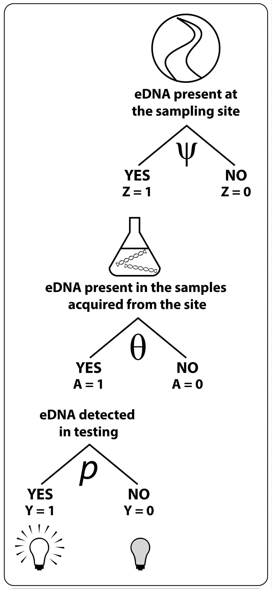

# Overview

This document provides an introduction to [occupancy models](https://www.nps.gov/olym/learn/nature/upload/OccupancyModelFactSheet.pdf) in [Stan](http://mc-stan.org/).
The terms occupancy models and occurrence models can be used synonymous from a statistical and programming perspective, but can have important ecological differences from a scientific perspective. 
Both terms are used interchangeably within this document unless specifically indicated that one term is appropriate for a specific use.

## Motivation 

This document was created help collaborators learn how program occupancy models in Stan. 
Occupancy models can be difficult to program in Stan because they have discrete latent variables (i.e., the site-level occupancy).
However, compared to other Bayesian programs, Stan can offer better [performance](http://andrewgelman.com/wp-content/uploads/2014/06/stan-overview-dauphine-2014.pdf) (e.g., more rapidly fitting models, converging when other models could not, fewer iterations required).

## Prerequisite knowledge and background 

This tutorials assumes the reader is familiar with R, occupancy models, and Bayesian statistics. Some base knowledge of Stan would be helpful, even if it is just completing the schools "hello world" [example](https://github.com/stan-dev/rstan/wiki/RStan-Getting-Started). 
This tutorial builds upon a previous [example tutorial](https://github.com/stan-dev/example-models/blob/master/misc/ecology/occupancy/occupancy.stan), which I helped to update. 
Another [tutorial](https://mbjoseph.github.io/posts/2018-12-27-dynamic-occupancy-models-in-stan/) I found did not use current Stan syntax. 
Last, [a multi-species tutorial exists](http://mc-stan.org/users/documentation/case-studies/dorazio-royle-occupancy.html), but is beyond the (current) scope of this tutorial 


## Summary of tutorial 

The introduction covers a brief overview of occupancy models, logistic regression in Stan and R, and matrix notation in R. 
Next, two-level occupancy models are introduced.
Following this, three-level occupancy models are introduced.
More topics may be included (e.g., changing variance structures or correlated estimates) as I have time or need to program these models.


# Introduction

This section provides a crash course on useful topics and code for using occupancy models with Stan in R. 


## A brief overview of occupancy models 

Occupancy models allow for imperfect detection.
For example, if I look out my kitchen window and do not see a robin, why did I not see it?
Maybe the bird was not there or maybe I missed it.
If I look out my kitchen window on a regular basis, I could use an occupancy model to estimate my probability of detection.
Occupancy models can be extended to other situations with imperfect detection as well.

## Perfect detection: The logistic regression

In a world with perfect detection (i.e., $p$ = 1), we would not need occupancy models because the species we are looking for would always be detected if they were present. 
In these situations, we could simply use a logistic regression to model the probability that a site is occupied.
In base R, we would use the `glm()` function to fit this model using a maximum likelihood approach:


```r
glm(y ~ x, family = 'binomial')
```

Note, that if we want, we can fit the model using a probit link function rather than a logit:

```r
glm( y ~ x, family = binomial(link = 'probit'))
```


Many [good tutorials exist on the differences between probits and logits](http://lmgtfy.com/?q=probit+vs+logit).
Usually, the models produce similar results, although the logit has a slightly fatter tail. 
Personally, I prefer logits if for no other reason than that is what my PhD advisor used.
The reason for mentioning the logit versus probit is that we need to be explicit about our modeling assumption when moving on to Stan and knowing other options exist help see why. 


The logit model may be also easily coded in Stan as well. 
I would save this script as a `logistic_stan.stan` (**Important note:** Stan models must end with `.stan` with a lower case `s`, otherwise the model will not be complied):

    data {
      int<lower=0> N;
      vector[N] x;
      int<lower=0,upper=1> y[N];
    }
    parameters {
      real alpha;
      real beta;
    }
    model {
      y ~ bernoulli_logit(alpha + beta * x);
    }


After saving this code as `logistic_stan.stan`, we can call the model from R. We'll simulate some data and format it to work with Stan here as well.


```r
library(rstan)
options(mc.cores = parallel::detectCores())

### simulate and examine raw data
n_obs = 20
x_label <- factor(rep(c("a", "b"), times = n_obs)) # used to Id variables
x_prob  <- rep(c(0.25, 0.75), times = n_obs) # used to simulate data
y <- rbinom(n = n_obs * 2, size = 1, p = x_prob)
aggregate(y, by = list(x_label), FUN = mean)

### First, we fit a GLM using base R
glm_out <- glm(y ~ x_label, family = 'binomial')
summary(glm_out)

### Second, we fit the model using Stan:
stan_data <- list(N = length(y),
                  x = as.numeric(x_label) - 1,
                  y = y)

stan_model <- stan_model(file = "logistic_stan.stan")

stan_out <- sampling(stan_model, data = stan_data, chains = 4, iter = 500)

### Useful functions for looking at Stan outputs include:
print(stan_out)
traceplot(stan_out)
traceplot(stan_out, inc_warmup = TRUE)
plot(stan_out)
pairs(stan_out)
```

A few things to point out.

1. Unlike base R, rstan does not have a nice wrapper function. This means we must use integers as the id variable each observation rather than characters or factors.
2. You will want to increase the number of iterations when actually running the model for use. When troubleshooting, I use 100s. When running for publication, I use 1,000s to 10,000s or more.
3. Notice the Bayesian model diagnostics. If these are unfamiliar to you, I suggest working through BDA3 by Gelman et al. or other introductory Bayesian stats book. The [Shinystan](http://mc-stan.org/users/interfaces/shinystan) interface provides many different Bayesian diagnostics tools that work with Stan.


However, when working with occupancy, we must account for imperfect detection.
Because of this, and the details of how Stan works under the hood, we cannot use the default probability functions for Stan. 
To introduce this topic, we will next look at using the probability `target` in Stan. 
The `+=` opperator is a programming shortcut.
For example `x = x + 2`, can be written as `x += 2`.
Our code now looks like this and is saved in the file `logistic_target_stan.stan`:

    data {
      int<lower=0> N; // Number of samples
      vector[N] x; // predictor vector
      int<lower=0,upper=1> y[N];//response vector
    }
    parameters {
      real alpha; //intercept
      real beta; ///slope
    }
    model {
      for( index in 1:N){
        target += binomial_logit_lpmf( y[index] | 1, alpha + beta * x[index]); 
          }
    }

From both of the above example, there are some important features of Stan to note:

First, unlike R or JAGS, Stan requires us to explicitly declare variables like C++. 
A downside is that the language can be less forgiving.
An upside is that the language makes us be precise and makes it harder to "programming by coincidence".
Rather than simply estimate parameters using a model, we must understand their data structure within the model.
That being said, I've spend many an hour refreshing my linear algebra skills to understand my Stan code and dimensions of objects.
But, the end products were code that I now trust and run quickly.

Second, Stan uses code blocks.
These are defined in the Stan manual.
In a nutshell, the require us to declare the input `data`, the estimated `parameters`, and our `model`.
There are also other types of blocks you can look up in the manual and we might see some of them later. 

Third, we can include comments with `//` or blocks of code with `/* comment here */`.


```r
## Complie the model
stan_model_target <- stan_model("logistic_target_stan.stan")

## Sample from the model
stan_out_target <- sampling(stan_model_target,
                            data = stan_data, chains = 4,
                            iter = 1000)

## Useful functions for looking at Stan outputs include:
print(stan_out_target, pars = c("alpha", "beta", "lp__"))
traceplot(stan_out_target, pars = c("alpha", "beta", "lp__"))
traceplot(stan_out_target, inc_warmup = TRUE, pars = c("alpha", "beta", "lp__"))
plot(stan_out_target, pars = c("alpha", "beta", "lp__"))
```

**Exercise**: Using the code above, fit a probit regression. You'll need to go to the Stan documentation to figure this out. This exercise will also likely take you 1 hr to a couple of days depending upon your abilities with Stan. 

## Binomial versus Bernoulii and long versus wide data

Another important concept for occupancy modeling is data structure and probability distributions.
The Bernoulli distribution models  one sampling event (often denoted as $K =1$).
For example, we might flip a coin once and record this as a data entry.
The Bernoulli is a special case of a binomial distribution. 
The binomial distribution allows us to have multiple sampling events. 
For example, we might flip a coin 10 times and record the number of heads and tails as their own columns.

For both general data analysis and occupancy modeling, I use both distributions. 
When fitting a simple binomial GLM in R, my modeling choice depends upon the structure of the data.
I use a Bernoulli style input (a vector of 0s and 1s for `y`) if my data has coefficients for each observation or the data was given to me in that format.
I use a binomial style input if my data has been aggregated or I want to avoid [pseudoreplication](https://doi.org/10.2307/1942661) (e.g., the tank is the level of replication rather than the individual).
R has two methods for inputting binomial style data.
First, a matrix of "successes" and "failures" maybe used for `y`.
Second, a vector of probabilities may be used for `y` and a `weight =` option specified. 
Closely relate to these distributions are the data concepts of ["wide versus long data in R"](http://lmgtfy.com/?q=wide+versus+long+data+r) and "aggregate versus raw data".

During this code example, you will see how to fit a model using all three methods as well as how to convert code between wide and long formats. 


```r
## Simulate data in long format
set.seed(1223)
xSim <- rep(c(0.25, 0.75), each = 14)
x <- rep(c("a", "b"), each = 14)
y <- rbinom(n = length(xSim), size = 1, prob = xSim)
data_long <-
    data.frame(x = x,
               y = factor(y, labels = c("fail", "success")))

### cast the data to wide format using tidyverse
library(tidyverse)
data_wide <-
    data_long %>%
    group_by(x,y) %>%
    summarize(N = n()) %>% 
    spread( y, N) %>%
    mutate(Total = success + fail,
           success_proportion = success / (success + fail))
data_wide

### Compare the three methods for fitting a logistic regression in R
glm(y ~ x, family = 'binomial', data = data_long)

glm(cbind(fail, success) ~ x, family = 'binomial', data = data_wide)

glm(success_proportion ~ x, family = 'binomial', data = data_wide,
    weights = Total)
```

For occurrence models in Stan, we must use the Bernoulli distribution (or Binomial with `K = 1`) for the latent variables because we cannot aggregate the data.
Specifically, we need details about each replicate at a lower level.
For example, We cannot aggregate and say that 3 sites had Robins and 2 sites did not. Instead, we need a vector of of these site-level detentions, for example `c(0, 1, 1, 0, 1, 1, 1)`.
For the lowest level of the occurrence model, I often do use a Bernoulli distribution when I do not have coefficients at the observation-level because there are fewer data entries to aggregate over.
We will see these in later chapters. 

## Matrix notation and occupancy models


Models in R such as `lm()` and `glm()` allow users to input [formuals](https://stat.ethz.ch/R-manual/R-devel/library/stats/html/formula.html).
Formulas allow users to input factors and have R convert them to a matrix of dummy variables. 
[`model.matrix()`](http://stat.ethz.ch/R-manual/R-devel/library/stats/html/model.matrix.html) allows us to create these same type matrices of input variables. 
There are several benefits to using `model.matrix()` to pre-process inputs for Stan.
First, it allows us to easily turn factors into [dummy variables](https://en.wikipedia.org/wiki/Dummy_variable_(statistics)).
Second, it allows us to easily have matrices of predictors, which in turn allows us to us matrix algebra within Stan. 
This section introduces `model.matrix()` so that it will be familiar to us later. 
**Note:** I use shorter matrices than most real applications to save screen space.
 
 
### model.matrix basis 

`model.matrix()` use the `~` (shift-\` on US keyboards) for its input.
In statistical English, this could be read as "predicted by", for example `y ~ x` could be spoken or read as y predicted by x.
The follow example demonstrates how it may be used on a simple factor data.frame:


```r
df <- data.frame(city = c("La Crosse", "St. Louis", "Cairo"))
model.matrix( ~ city, data = df)
```

```
##   (Intercept) cityLa Crosse citySt. Louis
## 1           1             1             0
## 2           1             0             1
## 3           1             0             0
## attr(,"assign")
## [1] 0 1 1
## attr(,"contrasts")
## attr(,"contrasts")$city
## [1] "contr.treatment"
```

Things to notice about `model.matrix()`:

1.  `model.matrix()` converted city to an alphabetical order factor.
2.  The first factor is the first in alphabetically. This order may be [changing the factor order in R](http://lmgtfy.com/?q=change+r+factor+order).
3.  The first factor become a global intercept and the other two levels are compared to this. In the next section, we'll see how to change this.

### Intercept for each level 

If we want an intercept for each factor level, we use a `- 1` in the notation.


If we have multiple factors, we can only estimate intercepts for all of one of the factors. 
For example, if we have months and city, we would need a reference month _or_ reference city. 
Also, notice how order matters.
Most advanced book on regression analysis explains this in greater detail (e.g., [Harrell](http://biostat.mc.vanderbilt.edu/wiki/Main/RmS) or [Gelman and Hill](http://www.stat.columbia.edu/~gelman/arm/)). 


```r
df <- expand.grid(city = c("La Crosse", "St. Louis", "Cairo"),
                  month = c("May", "June"))
model.matrix( ~ city + month -1, data = df)
model.matrix( ~ month + city -1, data = df)
```

### numeric vs factors

We can also use numeric inputs with `model.matrix()`
For example, if we input month as a numeric vector, R creates a matrix with month as a numeric column.
If we were using the matrix in a regression, this new column would correspond to a slope estimate. 


```r
df1 <- expand.grid(month = c( 5, 6, 7))
model.matrix( ~ month, data = df1)
```

```
##   (Intercept) month
## 1           1     5
## 2           1     6
## 3           1     7
## attr(,"assign")
## [1] 0 1
```

Conversely, if we input month as a factor, we get similar results as before.

```r
df2 <- expand.grid(month = factor(c( 5, 6, 7)))
model.matrix( ~ month, data = df2)
```

```
##   (Intercept) month6 month7
## 1           1      0      0
## 2           1      1      0
## 3           1      0      1
## attr(,"assign")
## [1] 0 1 1
## attr(,"contrasts")
## attr(,"contrasts")$month
## [1] "contr.treatment"
```
The purpose of this example is to demonstrate how R can sometimes produce unexpected results, especially if we want a measure of time to correspond to an intercept estimate rather than a slope estimate. 

### Subtract 1 from as.numeric()

Closely related to the above point is a problem I have run into when creating binary response variables in R for use with Stan.
For example, let's say we want to model occupancy for a lake and a river:


```r
set.seed(12351513)
df_occ <-
    data.frame(occ = factor(sample(rep(c("yes", "no"), each = 10))),
               site = factor(rep(c("lake", "river"), each = 10)))
```

Using Base R, we could just run `glm()` on this data:


```r
summary(glm(occ ~ site, data = df_occ, family = 'binomial'))
```

But, look at what happens if we try and convert `occ` to a binary response:


```r
### base line 
as.numeric(factor(df_occ$occ))
### need -1 to create a vecor of zeros and ones
as.numeric(factor(df_occ$occ)) - 1
```

Now that you've had a crash course on R topics, let's build our first occupancy model with Stan. 

## Review of log rules and probability 

As you will see in the upcoming chapters, Stan requires marginalizing out discrete latent variables. 
This requires working with probabilities.  
Probabilities are often log transformed to increase numerical stability (or, informally: make the equations easier for the computer to solve) AND to change from multiplication to addition. 
Here are some quick refreshers of log rules:

- $\text{log}(xy) = \text{log}(x) + \text{log}(y)$
- $\text{log}(0) = 1$


For example, let's say we flip a coin once.
The coin has probability $p$ of heads and probability $1-p$ of tails.  
We get a heads, which we call 1. 
If we flip the coin 4 times, our outcome could be 1001. 
The probability of this occurring would be: $p(1-p)(1-p)p$. 
The product may be denoted using the product operator $\prod$ (much like $\sum$ is used for summation) and generalized.  
We have $N$ trials and we index over $i$. 
Trials with heads are considered _successes_, which is denoted with a superscript $s$ = 1. 
Trials with tails have $s = 0$. 
These superscripts make the terms either be themselves (e.g., $p^1 = p$) or 1 (e.g., $p^0 = 1$). 
We can write the probability of the event occurring as $P(y|p)$, which is read as the probability of observation $y$ give probability $p$. 
This leads to the formulation:

$$P(y|p) =  \prod_{i = 1}^N p^{s_i} (1-p)^{1-s_i}.$$

Taking the log of this gives 

$$\text{log}(P(y|p)) =  \sum_{i = 1}^N log(p^{s_i}) + \log( (1-p)^{1-s_i}).$$

Two key takeaways. 
First, notice how the product now became a summation. 
Second, $x \times 1 = x$ and now $x + \text{log(1)} = x + 0 = x$

MacKenzie et al. covers these calculations for occupancy models in chapter 4 of their book. 


# Two-level occupancy models


This chapter builds up  a series of two-level occupancy models in Stan. 
The models start simple and then build to more complicated models. 
The purpose of this is twofold. 
First, it provides an introduction and overview of these models.
Second, the transformations buildup to allow for more complicated models such as those used for eDNA or other structures. 
For the purpose of this chapter we use the term _sampling unit_ to refer to the observation.
Sampling units can be replicated across space, time, or both. 

This chapter usesa simple occupancy model that has one site with multiple observation points (e.g., cameras or traps). 
This model is presented in four different forms:

1.  The first and simplest model directly estimates probabilities of detection and occupancy. 
This model takes a site-by-visit (row of sites, columns of visits or surveys to each site) matrix as the input. 
2. The second model then gets changed to estimate parameters on the logit-scale. 
3. The third model uses an input vector of the sum of number visits with detentions. 
4. The fourth model uses an input vector of binary observations for each visit to a site. 

## Simple occupancy model overview 

We will start by building a simple occupancy model that only includes a global intercept at each level. 
This example is based upon the Stan example provided by [Bob Carpenter](https://github.com/stan-dev/example-models/blob/master/misc/ecology/occupancy/occupancy.stan).
The model assumes the same probability of detection for each observation.

The probability that any site is occupied is $\psi$ and is estimated on the logit scale: $\mu_\psi$.
$\mu_\psi$ is predicted by $X \beta$ (This is a [matrix regression notation](https://en.wikipedia.org/wiki/Linear_regression)).
If a site is occupied during a visit, $Z = 1$, otherwise, it would be zero. 
During simulations, we simulate this value and it is known. 
With actual data, we have a $Z_{obs}$. 
The probability of detection at a site is $p$ and is estimated on the logit scale: $\mu_{p}$.
$\mu_\psi$ is predicted by $V \alpha$.
The raw data for this would $Y$ where the index of $Y$ corresponds to the observation.
$Y$ must be binary (i.e., 0s or 1s).
Because we are estimating a single intercept, we only need a vector of 1s as our predictor matrix (or, in this case, scalar) $X$.
Note that we could simplify this model several ways (e.g., hard coding a single intercept, estimating on the probability scale rather than logit), but use the current formulation because we need these tools later either to extend the model or for numerical efficiency. 

### Matrix input occupancy model

The model in Stan contains three code blocks. 
The first is the `data` block:

    data {
      int<lower=0> n_sampling_units
      int<lower=0> n_surveys;
      int<lower=0,upper=1> y[n_sampling_units, n_surveys];
    }
	
	
which defines the input data into Stan.
The second is the `parameters` block: 

    parameters {
      real<lower=0,upper=1> psi;
      real<lower=0,upper=1> p;
    }
	
which defines the parameters being estimated.
The third block is the `model` block.
This block includes local variables to increase the computational efficient of the code.
The code also includes priors.
If a user does not specify priors with Stan, then Stan has default priors that account for the constraints of parameters.
The third part of the block is the likelihood function.
This includes an if-else statement to account for detection (`if`) or non-detection (`else`) at a site.

    model {
      // local variables to avoid recomputing log(psi) and log(1 - psi)
      real log_psi;
      real log1m_psi;
      log_psi = log(psi);
      log1m_psi = log1m(psi);
    
      // priors
      psi ~ uniform(0,1);
      p   ~ uniform(0,1);
      
      // likelihood
      for (r in 1:n_sampling_units) {
        if (sum(y[r]) > 0)
          target += log_psi + bernoulli_lpmf(y[r] | p);
        else
          target += log_sum_exp(log_psi + bernoulli_lpmf(y[r] | p),
    			    log1m_psi);;
      }
    }

The data simulation process also can provide us with insight into the how the model works and how we assume our data generation process works. 
For this case, we are specifying the number of sites and visits (or surveys) per site. 
We also specify our simulated probability of detection $p$, `p`, and site occupancy probability $psi$, `psi`.
The next simulation step is to simulate if the sites are occupied and then simulation the surveys at each site. 
Last, the data are wrapped into a list for Stan.


```r
## Simulate true occupancy states

set.seed(1234)
## number of sampling units 
n_sampling_units <- 250
## visits per sampling unit 
n_surveys <- 10
p <- 0.6
psi <- 0.4

## simulate site-level occupancy
z <- rbinom( n_sampling_units, 1, psi)

## simulate  sample-level detections 
y <- matrix( NA, n_sampling_units, n_surveys);
for (site in 1:n_sampling_units){
    y[site,] <- rbinom( n_surveys, 1, z[site] * p)
}


simple_model_input <- list(n_sampling_units = n_sampling_units,
                           n_surveys = n_surveys,
                           y = y)
```

**Modeling building tip: ** When building a Stan model, I examine the raw data and make sure the Stan model matches the data. 
Although, this can be an iterative process, because I often discover my data requires wrangling to work with Stan. 
 In this process, I usually start the iterative process with the data because it is easier to work with. 

Now that we've simulated the data, we can use it with our model. 
First, we compile the model with `stan_model()`. 
Second, we sample from the model using `sampling()`.


```r
## Fit the model in stan

model_wide <- stan_model('./occupancy.stan')

fit_wide <- sampling(model_wide, simple_model_input)
fit_wide
```

After fitting the model, we can look at the outputs. 
The default `print()` option for a `stanfit` object shows a summary of the model's fit. 
In this case, typing `fit_wide` prints these results:


```r
Inference for Stan model: occupancy.
4 chains, each with iter=2000; warmup=1000; thin=1; 
post-warmup draws per chain=1000, total post-warmup draws=4000.

        mean se_mean   sd    2.5%     25%     50%     75%   97.5% n_eff Rhat
psi     0.37    0.00 0.03    0.32    0.35    0.37    0.39    0.43  3587    1
p       0.60    0.00 0.02    0.56    0.58    0.60    0.61    0.63  4000    1
lp__ -796.37    0.02 1.01 -799.03 -796.74 -796.08 -795.65 -795.38  1996    1

Samples were drawn using NUTS(diag_e) at Thu Aug 30 13:03:08 2018.
For each parameter, n_eff is a crude measure of effective sample size,
and Rhat is the potential scale reduction factor on split chains (at 
convergence, Rhat=1).
```

If these results do not make sense, I strongly recommend either reviewing/learning Stan and Bayesian statistics. 

**Exercise:** Simulate different datasets. 
Using different occupancy probabilities and sample sizes. 
Figure out when the model works well and when it does not. 

### Matrix input occupancy model on logit-scale

We can take the model from the previous section and make it more numerically efficient by calculating on the logit scale. 
This new formulation also allows the inclusion of predictor variables, much like a logistic regression.

This model is different because we are now estimating $\mu_p$ and $\mu_\psi$ rather than these parameter directly.
Note that $\mu_p = \text{logit}^{-1}(p)$ and $\mu_\psi = \text{logit}^{-1}(\psi)$.
This means the parameter block for our model is different:


    parameters {
      real muPsi;
      real muP;
    }


The model code block is also written differently now.
Key differences include

  - Slightly different likelihood functions are used; and 
  - the `mu` parameters are now real number that can range from minus infinity to positive infinity. 

However, the model is still very similar to the previously defined model.

    model {
    
      real log_muPsi;
      real log1m_muPsi;
    
      log_muPsi   = log_inv_logit(muPsi);
      log1m_muPsi = log1m_inv_logit(muPsi);
    
      muP ~ normal(0, 2);
      muPsi ~ normal(0, 2);
      
      // likelihood
      for (r in 1:n_sampling_units) {
        if (sum(y[r]) > 0)
          target +=
    	log_muPsi + bernoulli_logit_lpmf(y[r] | muP);
        else
          target +=
    	log_sum_exp(log_muPsi +
    		    bernoulli_logit_lpmf(y[r] | muP), log1m_muPsi);
      }
    }

We can transform the parameters to the logit scale to the probability scale in Stan using the `generated quantities` code block. 
This code block is complied so it is quick, but does not get run through MCMC algorithm and slow down the model. 

    generated quantities{
      real<lower = 0, upper = 1> p;
      real<lower = 0, upper = 1> psi;
    
      p   = inv_logit(muP);
      psi = inv_logit(muPsi);
    }

This model is fit the same as previous model.


```r
## Fit the model using parameters on the mu scale
model_wide_mu <- stan_model('./occupancy_mu.stan')

fit_wide_mu <- sampling(model_wide_mu, data = simple_model_input)
fit_wide_mu
```

The outputs are similar, other than having small numerical differences due to Monte Carlo variability. 
The output also include the `muP` and `muPsi` parameters. 


```r
Inference for Stan model: occupancyMu.
4 chains, each with iter=2000; warmup=1000; thin=1; 
post-warmup draws per chain=1000, total post-warmup draws=4000.

         mean se_mean   sd    2.5%     25%     50%     75%   97.5% n_eff Rhat
muPsi   -0.53    0.00 0.13   -0.78   -0.62   -0.53   -0.44   -0.27  3111    1
muP      0.39    0.00 0.07    0.26    0.34    0.39    0.43    0.52  3136    1
p        0.60    0.00 0.02    0.56    0.58    0.60    0.61    0.63  3139    1
psi      0.37    0.00 0.03    0.31    0.35    0.37    0.39    0.43  3125    1
lp__  -793.54    0.02 1.01 -796.18 -793.90 -793.21 -792.83 -792.56  1700    1

Samples were drawn using NUTS(diag_e) at Thu Aug 30 13:26:44 2018.
For each parameter, n_eff is a crude measure of effective sample size,
and Rhat is the potential scale reduction factor on split chains (at 
convergence, Rhat=1).
```

### Binomial input

The previous example assumed that we had the same number of observations per site. 
One method to side-step this assumption is to use a binomial input rather than a Bernoulli.
Now our input `y` is the number of surveys or visits where detections occurred and we need a new input `k`, which corresponds to the number of surveys per sites. 

We can summarize our data to be in the needed format and put it into a list for Stan.

```r
## Now use summizations of the data
y_sum <- apply(y, 1, sum)
k <- rep(dim(y)[2], dim(y)[1])

stan_sumation_data <-
    list(
        n_sampling_units = n_sampling_units,
        y = y_sum,
        k = k)
```

This formulation also changes the `data` block of the model:


    data {
      int<lower=0> n_sampling_units;
      int<lower=0> y[n_sampling_units];
      int<lower=0> k[n_sampling_units];
    }

As well as the likelihood portion of the `model`:

    // likelihood
      for (r in 1:n_sampling_units) {
        if (y[r] > 0)
          target +=
    	log_muPsi + binomial_logit_lpmf(y[r] | k[r],  muP);
        else
          target +=
    	log_sum_exp(log_muPsi +
    		    binomial_logit_lpmf(y[r] | k[r], muP), log1m_muPsi);
      }

Before we can fit the model, we need to sum and reformat our data our data:


```r
## Now use summizations of the data
y_sum <- apply(y, 1, sum)
k <- rep(dim(y)[2], dim(y)[1])

stan_sumation_data <-
    list(
        n_sampling_units = n_sampling_units,
        y = y_sum,
        k = k)
```


We can then fit this model using Rstan and look at the results, which are similar to the previous results:


```r
stan_model_mu_binomial  <- stan_model('./occupancy_mu_binomial.stan')

fit_mu_binomial <- sampling(stan_model_mu_binomial,
                            data = stan_sumation_data)

fit_mu_binomial
```


```r
Inference for Stan model: occupancyMuBinomial.
4 chains, each with iter=2000; warmup=1000; thin=1; 
post-warmup draws per chain=1000, total post-warmup draws=4000.

         mean se_mean   sd    2.5%     25%     50%     75%   97.5% n_eff Rhat
muPsi   -0.52    0.00 0.13   -0.78   -0.61   -0.52   -0.43   -0.27  3619    1
muP      0.39    0.00 0.07    0.26    0.35    0.39    0.43    0.52  3589    1
p        0.60    0.00 0.02    0.56    0.59    0.60    0.61    0.63  3589    1
psi      0.37    0.00 0.03    0.31    0.35    0.37    0.39    0.43  3619    1
lp__  -342.89    0.02 1.02 -345.71 -343.27 -342.57 -342.15 -341.90  1709    1

Samples were drawn using NUTS(diag_e) at Thu Aug 30 14:31:42 2018.
For each parameter, n_eff is a crude measure of effective sample size,
and Rhat is the potential scale reduction factor on split chains (at 
convergence, Rhat=1).
```

### Long format occupancy model

What if our data is in a "long format" with one row per survey and sampling unit?
Then, we can build a model, but it is trickier. 
I received help from [Max Joseph on the Stan user forum](https://discourse.mc-stan.org/t/identifiability-across-levels-in-occupancy-model/5340) who wrote this model.
Before diving into the Stan code, the data needs to mutated to be the correct shape. 
I use the `Tidyverse` for this. 
One key part of this code is creating the index of start and ending numbers numbers for each survey.


```r
## Convert to long format
y_df <- 
    y %>%
    as.data.frame() %>%
    mutate(site = factor(1:n_sampling_units),
           z_obs = ifelse(rowSums(y) >0, 1, 0))

y_long <-
    y_df %>%
    gather(survey, y,  -site, -z_obs) %>%
    arrange(site) %>%
    mutate(index = 1:nrow(y_long))

head(y_long, 12)
tail(y_long, 12)

y_long_summary <-
    y_long %>%
    group_by(site) %>%
    summarize(any_seen = ifelse(sum(y) >0, 1, 0),
              N = n())

X_psi  <-  model.matrix( ~ 1, data = y_long_summary)
n_site <- y_long %>% pull(site) %>% unique() %>% length()
m_psi  <- ncol(X_psi)

total_surveys <- nrow(y_long)

X_p <- model.matrix( ~ 1, data = y_long)
m_p <- ncol(X_p)
    
start_end <-
    y_long %>%
    group_by(site) %>%
    summarize(start_idx = min(index),
              end_idx = max(index))

site = y_long %>% pull(site) %>% as.numeric()

stan_d <- list(
    n_site = n_site,
    m_psi = m_psi,
    X_psi = X_psi,
    total_surveys = total_surveys, 
    m_p = m_p, 
    X_p = X_p, 
    site = site,
    y = y_long %>% pull(y),
    start_idx = start_end %>% pull( start_idx),
    end_idx = start_end %>% pull( end_idx),  
    any_seen = y_long_summary %>% pull(any_seen), 
    n_survey = y_long_summary %>% pull(N)
    )
```

The code for this Stan model become more complicated. 
First, we cannot simply loop over raw observations. 
Instead, we need to "cut" out the observations for each survey (site visit). 
This model also includes the ability to include coefficients at different levels, but these will not be discussed until the next section.
These coefficient include matrices of predictors.
These are same type that are created by `model.matrix()`.

    data {
      // site-level occupancy covariates
      int<lower = 1> n_sampling_units;
      int<lower = 1> nPsiCoef;
      matrix[n_sampling_units, nPsiCoef] Xpsi;
      
      // survey-level detection covariates
      int<lower = 1> totalSurveys;
      int<lower = 1> nPCoef;
      matrix[totalSurveys, nPCoef] Vp;
    
      // survey level information  
      int<lower = 1, upper = n_sampling_units> site[totalSurveys];
      int<lower = 0, upper = 1> y[totalSurveys];
      int<lower = 0, upper = totalSurveys> startIndex[n_sampling_units];
      int<lower = 0, upper = totalSurveys> endIndex[n_sampling_units];
      
      // summary of whether species is known to be present at each site
      int<lower = 0, upper = 1> z[n_sampling_units];
      
      // number of surveys at each site
      int<lower = 0> nSurveys[n_sampling_units];
    }
    parameters {
      vector[nPsiCoef] beta_psi;
      vector[nPCoef] beta_p;
    }
    transformed parameters {
      vector[totalSurveys] logit_p = Vp * beta_p;
      vector[n_sampling_units] logit_psi = Xpsi * beta_psi;
    }
    model {
      vector[n_sampling_units] log_psi = log_inv_logit(logit_psi);
      vector[n_sampling_units] log1m_psi = log1m_inv_logit(logit_psi);
      
      beta_psi ~ normal(0, 1);
      beta_p ~ normal(0, 1);
      for (i in 1:n_sampling_units) {
        if (nSurveys[i] > 0) {
          if (z[i]) {
            // site is occupied
            target += log_psi[i] 
                      + bernoulli_logit_lpmf(y[startIndex[i]:endIndex[i]] | 
                                             logit_p[startIndex[i]:endIndex[i]]);
          } else {
            // site may or may not be occupied
            target += log_sum_exp(
              log_psi[i] + bernoulli_logit_lpmf(y[startIndex[i]:endIndex[i]] |
                                                logit_p[startIndex[i]:endIndex[i]]), 
              log1m_psi[i]
            );
          }
        }
      }
    }

After building this model, it may be fit like any other model. 
Notice the use of the `pars` option in print to only print the parameters of interest. 
Also, this model did not calculate probabilities because of the coefficients. 


```r
## Fit long form model 
stan_model_bern <- stan_model("./occupancy_bernoulli.stan")

fit_bern <- sampling(stan_model_bern,
                     data= stan_d,
                     chains = 4, iter = 2000)

print(fit_bern, pars = c("beta_psi", "beta_p"))

##              mean se_mean   sd  2.5%   25%   50%   75% 97.5% n_eff Rhat
## beta_psi[1] -0.52       0 0.13 -0.78 -0.60 -0.51 -0.43 -0.27  3909    1
## beta_p[1]    0.39       0 0.07  0.25  0.34  0.39  0.43  0.51  3393    1
```

And the outputs from the model are similar to the other models.


```r
Inference for Stan model: bernoulli-occupancy.
4 chains, each with iter=2000; warmup=1000; thin=1; 
post-warmup draws per chain=1000, total post-warmup draws=4000.

             mean se_mean   sd  2.5%   25%   50%   75% 97.5% n_eff Rhat
beta_psi[1] -0.52       0 0.13 -0.78 -0.60 -0.51 -0.43 -0.27  3909    1
beta_p[1]    0.39       0 0.07  0.25  0.34  0.39  0.43  0.51  3393    1

Samples were drawn using NUTS(diag_e) at Thu Aug 30 15:01:05 2018.
For each parameter, n_eff is a crude measure of effective sample size,
and Rhat is the potential scale reduction factor on split chains (at 
convergence, Rhat=1).
```
Converting these values to probabilities with the `plogis()` function shows the results are similar to the other modeling methods:


```r
plogis(-0.52)
```

```
## [1] 0.3728522
```

```r
plogis(0.39)
```

```
## [1] 0.5962827
```

## Summary

This chapter provided an introduction to two-level occupancy models in Stan. 
The formatting and coding of the models became progressively more difficult, but in doing so, gives us the opportunity to do more with the models. 


# eDNA-based occupancy models


This chapter covers occupancy models with subsampling. 
The motivating example are eDNA-based occupancy models. 
Specifically, those with three levels: Site-level occupancy; Sample-level capture probabilities; and Molecular-level detection probabilities. 
However, these models orated with ecological models with three-levels (e.g. sites, samples, and sub-samples) and this chapter could readily be applied to these models as well. 

The chapter includes a brief overview and background on eDNA. 
Then, the chapter covers the statistical challenges of occupancy models. 
Next, the chapter covers a Stan model for three-levels. 
Last, the chapter covers simulating data and fitting a Stan model to this data. 

## Background on eDNA-based sampling 

Most if not all organisms excrete DNA into their surroundings or environment. 
This DNA is called environmental or eDNA. 
Microbial and soil scientist have long used this DNA as a tool for detecting microbes in the soil because the method allows the detection of difficult to capture and culture species. 
More recently, macro biologists discovered the power of sampling DNA. 
We (the authors of this tutorial) have been motivated to examine the use eDNA as a monitoring tool for natural resource management, primarily driven to study and monitor aquatic invasive species. 

When sampling for eDNA, occupancy models must account for at least one extra level of detection. 
Most occupancy models examine the probability a site is occupied and the probability of detecting eDNA within that site. 
In contrast, eDNA-based sampling possesses three levels:

- The site-level occupancy probability of eDNA (e.g., is eDNA present at a site?);
- The sample-level capture probability of eDNA (e.g., does this water sample contain eDNA?);
- The molecular-level detection probability of eDNA  (e.g., did the PCR replicate detect eDNA?).

Currently no standard terminology exists for eDNA-based occupancy models. 
We based our terminology upon [Dorazio and Erickson (2017)](https://doi.org/10.1111/1755-0998.12735), who also provide a brief overview of the eDNA literature. 
In general, we do not include indexing to simplify this tutorial, but this indexing allows for multiple seasons or sites or both to be sampled (e.g., one site may be visited multiple times, multiple sites may be visited once, or multiple sites may be visited multiple times). 
Additionally, we use an inconsistent mix of scalar and matrix/vector notation. 



The first level of the model examines the occurrence of eDNA at a location. 
For example if we either visit the same site multiple times or visit multiple sites once, what's the probability eDNA will occur at the site. 
The binary state variable, $Z$, denotes the observation of eDNA at a location during a visit. 
If $Z = 0$, people did not detect eDNA in any samples. 
If $Z = 1$, people did detect eDNA in at least one sample from a visit to a site. 
The probability, $\psi$, denotes the probability of eDNA occurring at a site. 
These two are connected by a Bernoulli distribution: 

$$ Z \sim \text{Bernoulli}(\psi). $$

$\psi$ may include predictor variables $X$ and coefficients $\beta$. 
The simplest case estimates one $\psi$ (i.e., a global intercept). 
Alternatively, each site or season might have its own estimated probability (i.e., multiple intercepts) or we might have continuous or predictor variables (i.e., regression terms with multiple slopes and intercepts). 
These are estimated on the logit scale:

$$ logit(\psi) = \beta X. $$

The second level of the model examines the capture of eDNA in a sample. 
For example, if we collect multiple water samples at a site, what's the probability a sample contains eDNA? 
Capturing eDNA within a sample requires eDNA to be present a site. 
If $A = 1$, then at least one molecular replicate contained eDNA. 
If $A = 0$, then no molecular replicate contained eDNA. 
The probability, $\theta$, denotes the probability of eDNA occurring in a sample. 
These two are connected by a Bernoulli distribution, but also include a conditional statement, "|". 

$$ A \sim \text{Bernoulli}(\theta | Z ). $$

Like $\psi$, $\theta$ is estimated on the logit scale and can include predictor variable: 

$$ logit(\theta) = \alpha W. $$

In this case, $W$ is the predictor matrix and $\alpha$ are the regression coefficients. 

The third level of he model examines the detection of eDNA in a sample. 
For example, did our PCR assay detect eDNA in a sample?
Detecting eDNA within a sample requires eDNA to present within a sample. 
If $Y = 1$, then eDNA was detected within a molecular replicate. 
If $Y = 0$, then eDNA was not detected within a molecular replicate. 
This level of the model is the only level without a latent state variable. 
The probability, $p$ denote the probability of detecting eDNA within a sample. 
For this probability, we use a binomial distribution with $K$ draws, with $K$ corresponding to the number of molecular replicates. 
Thus, the two are connected by a binomial distribution:

$$ Y \sim \text{Binomial}(p | A, K). $$ 

Like the previous two probabilities, $p$ is estimated on the logit scale and can include predictor variables: 

$$ logit(p) = \delta V. $$

Here, $V$ is the predictor matrix and $\delta$ are the regression coefficients. 

## Statistical challenges 

Fitting the model presents statically challenges. 
From a numerical perspective, the model contains 2 levels of latent variables. 
These present challenges for Stan, which can be overcome by taking the discritizing the model. 
These are covered in the next section. 
Detecting eDNA at a site also presents philosophical challenges. 
What does the detection mean? 
Is the species present or only its DNA? 
Likewise, does the amount of eDNA correspond to the bioass or number of organisms present? 
What about the detection probabilities? 
These questions are beyond the scope of this tutorial, but are important as eDNA becomes an increasingly used tool. 


## Stan model 


Define input variales, describe here 


    data {
      // site-level occupancy covariates
      int<lower = 1> nSites;
      int<lower = 1> nPsiCoef;
      matrix[nSites, nPsiCoef] Xpsi;
      
      // sample-level detection covariates
      int<lower = 1> totalSamples;
      int<lower = 1> nPCoef;
      int<lower = 1> nThetaCoef;
      matrix[totalSamples, nPCoef] Vp;
      matrix[totalSamples, nThetaCoef] Wtheta;
    
      // sample level information  
      int<lower = 0> y[totalSamples];
      int<lower = 0, upper = 1> aObs[totalSamples];
      int<lower = 0> k[totalSamples];
      int<lower = 0, upper = totalSamples> startIndex[nSites];
      int<lower = 0, upper = totalSamples> endIndex[nSites];
      
      // summary of whether species is known to be present at each site
      int<lower = 0, upper = 1> zObs[nSites];
      
      // number of samples at each site
      int<lower = 0> nSamples[nSites];
    }
    parameters {
      vector[nPsiCoef] beta_psi;
      vector[nPCoef]   delta_p;
      vector[nThetaCoef]   alpha_theta;
    }
    transformed parameters {
      vector[totalSamples] logit_p     = Vp     * delta_p;
      vector[totalSamples] logit_theta = Wtheta * alpha_theta;
      vector[nSites] logit_psi         = Xpsi   * beta_psi;
    }


## Simulating data 


```r
library(rstan)
```

```
## Loading required package: StanHeaders
```

```
## Registered S3 methods overwritten by 'ggplot2':
##   method         from 
##   [.quosures     rlang
##   c.quosures     rlang
##   print.quosures rlang
```

```
## rstan (Version 2.18.9, GitRev: 2e1f913d3ca3)
```

```
## For execution on a local, multicore CPU with excess RAM we recommend calling
## options(mc.cores = parallel::detectCores()).
## To avoid recompilation of unchanged Stan programs, we recommend calling
## rstan_options(auto_write = TRUE)
```

```r
library(data.table)
options(mc.cores = parallel::detectCores())
rstan_options(auto_write = TRUE)
```


```r
set.seed(12345)
nSites       = 100
nSamples     = 10
k            = 8
totalSamples = nSites * nSamples
psi   = 0.8
theta = 0.6
p     = 0.3
```


```r
siteLevelData <- data.table(
    site  = 1:nSites,
    zSim  = rbinom(nSites, 1, psi))

sampleLevelData <-  data.table(
    site   = rep(1:nSites, each = nSamples),
    sample = rep(1:nSamples, times = nSites),
    theta = theta, 
    p = p,
    k = k
)

setkey(siteLevelData, "site")
setkey(sampleLevelData, "site")
dataUse <- siteLevelData[ sampleLevelData]
```


```r
## was eDNA captured in sample?
dataUse[ , aSim := zSim * rbinom(n = nrow(dataUse), size = 1, p = theta)]
## was eDNA detected in sample?
dataUse[ , y := rbinom(n = nrow(dataUse), size = k, p = aSim * p)]
## Calculate observed a and z
dataUse[ ,  aObs := ifelse(y > 0, 1, 0)]
dataUse[ ,  zObs := ifelse(sum(aSim) > 0, 1, 0), by = .(site)]
```


```r
psi
```

```
## [1] 0.8
```

```r
dataUse[ , mean(zSim)]
```

```
## [1] 0.8
```

```r
dataUse[ , mean(zObs)]
```

```
## [1] 0.8
```

```r
theta
```

```
## [1] 0.6
```

```r
dataUse[ zObs > 0, mean(aSim)]
```

```
## [1] 0.56375
```

```r
dataUse[ zObs > 0, mean(aObs)]
```

```
## [1] 0.54125
```

```r
p
```

```
## [1] 0.3
```

```r
dataUse[ aObs > 0, mean(y/k)]
```

```
## [1] 0.3262125
```


```r
siteSummary <- dataUse[ , .(a = ifelse(sum(y) >0, 1, 0), .N, sumY = sum(y),
                            z = ifelse(sum(zObs) >0, 1, 0)), by = site]
head(siteSummary)
```

```
##    site a  N sumY z
## 1:    1 1 10   10 1
## 2:    2 0 10    0 0
## 3:    3 1 10   17 1
## 4:    4 0 10    0 0
## 5:    5 1 10   12 1
## 6:    6 1 10   12 1
```


```r
Xpsi <- model.matrix( ~ 1, data = siteSummary)
nPsiCoef = dim(Xpsi)[2]

Vp <- model.matrix( ~ 1, data = dataUse)
nPCoef <- dim(Vp)[2]
dataUse[ , index:=1:nrow(dataUse)]
```


```r
startStop <- dataUse[ , .(start_idx = min(index),
                          end_idx = max(index)), by = site]
```


```r
y <- dataUse[ , y]
aObs <- dataUse[ , aObs]
k <- dataUse[ , k]
zObs = siteSummary[ , z]
startIndex <- startStop[ , start_idx]
endIndex   <- startStop[ , end_idx]


stanData <- list(nSites = nSites,
                 nPsiCoef = nPsiCoef,
                 Xpsi = Xpsi,
                 totalSamples = nrow(dataUse),
                 nPCoef = nPCoef,
                 nThetaCoef = nPCoef,
                 Vp = Vp,
                 Wtheta = Vp,
                 y = y,
                 k = k,
                 zObs = siteSummary[ , z],
                 startIndex = startIndex,
                 endIndex = endIndex,
                 nSamples = siteSummary[ , N],
                 aObs = dataUse[, aObs]
                 )
```


```r
fit <- stan('../ChaptersCode/eDNAOccupancy/eDNAoccupancy.stan',
                      data= stanData,
                      chains = 4, iter = 200)
fitSummary <- summary(fit)$summary
```


```r
traceplot(fit, pars = c("beta_psi", "alpha_theta", "delta_p",  "lp__"), inc_warmup = FALSE)
```

<!-- -->


```r
plot(fit, pars = c("beta_psi", "alpha_theta", "delta_p")) 
```

```
## ci_level: 0.8 (80% intervals)
```

```
## outer_level: 0.95 (95% intervals)
```

<!-- -->

```r
print(fit, pars = c("beta_psi", "alpha_theta", "delta_p",  "lp__"))
```

```
## Inference for Stan model: eDNAoccupancy.
## 4 chains, each with iter=200; warmup=100; thin=1; 
## post-warmup draws per chain=100, total post-warmup draws=400.
## 
##                   mean se_mean   sd    2.5%     25%     50%     75%
## beta_psi[1]       1.32    0.02 0.24    0.84    1.15    1.33    1.48
## alpha_theta[1]    0.43    0.01 0.15    0.13    0.33    0.43    0.53
## delta_p[1]       -0.77    0.00 0.07   -0.92   -0.82   -0.78   -0.73
## lp__           -356.44    0.07 1.11 -359.66 -357.00 -356.08 -355.64
##                  97.5% n_eff Rhat
## beta_psi[1]       1.82   140 1.01
## alpha_theta[1]    0.70   324 1.00
## delta_p[1]       -0.62   498 0.99
## lp__           -355.19   221 1.01
## 
## Samples were drawn using NUTS(diag_e) at Thu Jun 13 15:21:25 2019.
## For each parameter, n_eff is a crude measure of effective sample size,
## and Rhat is the potential scale reduction factor on split chains (at 
## convergence, Rhat=1).
```


```r
print(dataUse[ , mean(zSim)])
```

```
## [1] 0.8
```

```r
print(dataUse[ , mean(zObs)])
```

```
## [1] 0.8
```

```r
print(round(plogis(fitSummary[grep("beta_psi", rownames(fitSummary)), c(4,1,8)] ), 2))
```

```
##  2.5%  mean 97.5% 
##  0.70  0.79  0.86
```

```r
print(theta)
```

```
## [1] 0.6
```

```r
print(dataUse[ zObs > 0, mean(aSim)])
```

```
## [1] 0.56375
```

```r
print(dataUse[ zObs > 0, mean(aObs)])
```

```
## [1] 0.54125
```

```r
print(round(plogis(fitSummary[grep("alpha_theta", rownames(fitSummary)), c(4,1,8)] ), 2))
```

```
##  2.5%  mean 97.5% 
##  0.53  0.61  0.67
```

```r
print(p)
```

```
## [1] 0.3
```

```r
print(dataUse[ aObs > 0, mean(y/k)])
```

```
## [1] 0.3262125
```

```r
print(round(plogis(fitSummary[grep("delta_p", rownames(fitSummary)), c(4,1,8)] ), 2))
```

```
##  2.5%  mean 97.5% 
##  0.28  0.32  0.35
```
